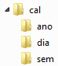
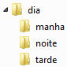
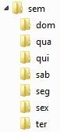
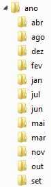

# Calendário

## Objetivos
* Avaliar suas habilidades de criação de diretórios (`mkdir`)
* Avaliar suas habilidades de exclusão de diretórios (`rmdir` ou `rm -rf`)
* Avaliar suas habilidades de navegação em diretórios (`cd` e `pwd`)
* Avaliar suas habilidades de listagem de arquivos (`ls`)
* Avaliar suas habilidades de criação de arquivos por meio de redirecionamento de saída (`>` ou `>>`)
* Avaliar suas habilidades de exibição de conteúdo de arquivos (`cat`)

## Dicas para navegação em diretório
|Símbolo|Descrição|Exemplo|
|:---:|:---|---|
|.|Diretório atual (`pwd`)|`./comando`|
|..|Diretório pai (superior)|`ls ../`; `ls ../../`; `cd ..`|
|~|Diretório HOME (pasta base do usuário) |`cd ~/Documents`|
|-|Diretório anterior|`cd -`|


## Roteiro
1. Crie uma pasta chamada `cal` e dentro dela crie as subpastas:
* `dia`
* `sem`
* `ano`



2. Dentro da pasta `cal`, crie o arquivo chamado `index.md` com o seguinte conteúdo:
```
# Calendário
* [Dia](./dia/)
* [Semana](./sem/)
* [Ano](./ano/)
```
Para criação do arquivo, você só poderá utilizar o comando `echo` e redirecionamento de saída padrão com `>` ou `>>`.

Converta o arquivo `index.md` para o formato HTML. Dica: Use a ferramenta [Pandoc](http://pandoc.org/).

3. Dentro da pasta `dia`, crie o arquivo chamado `index.md` com o seguinte conteúdo:
```
# Dia
* [Calendário](../)
```

Converta o arquivo `index.md` para o formato HTML. Dica: Use a ferramenta [Pandoc](http://pandoc.org/).

4. Dentro da pasta `sem`, crie o arquivo chamado `index.md` com o seguinte conteúdo:
```
# Semana
* [Calendário](../)
```

Converta o arquivo `index.md` para o formato HTML. Dica: Use a ferramenta [Pandoc](http://pandoc.org/).

5. Dentro da pasta `ano`, crie o arquivo chamado `index.md` com o seguinte conteúdo:
```
# Ano
* [Calendário](../)
```

Converta o arquivo `index.md` para o formato HTML. Dica: Use a ferramenta [Pandoc](http://pandoc.org/).

Terminadas as atividades acima, sigas as intruções para:
* [Dia](#dia) 
* [Semana](#semana)
* [Ano](#ano)

<a name="dia">

### Subpastas de um Dia
1. Dentro da pasta `dia` crie as subpastas:
* `manha`
* `tarde`
* `noite`



2. Dentro da pasta `dia`, crie o arquivo chamado `index.md` com o seguinte conteúdo:
```
# Dia
* [Manhã](./manha/)
* [Tarde](./tarde/)
* [Noite](./noite/)
* [Calendário](../)
```

Converta o arquivo `index.md` para o formato HTML. Dica: Use a ferramenta [Pandoc](http://pandoc.org/).

3. Dentro da pasta `manha`, crie o arquivo chamado `index.md` com o seguinte conteúdo:
```
# Manhã
* [Dia](../)
```

4. Dentro da pasta `tarde`, crie o arquivo chamado `index.md` com o seguinte conteúdo:
```
# Tarde
* [Dia](../)
```

5. Dentro da pasta ``, crie o arquivo chamado `index.md` com o seguinte conteúdo:
```
# Noite
* [Dia](../)
```

<a name="semana">

### Subpastas de uma Semana
1. Dentro da pasta `sem` crie as subpastas:
* `seg`
* `ter`
* `qua`
* `qui`
* `sex`
* `sab`
* `dom`



2. Dentro da pasta `sem`, crie o arquivo chamado `index.md` com o seguinte conteúdo:
```
# Semana
* [Segunda-feira](./seg/)
* [Terça-feira](./ter/)
* [Quarta-feira](./qua/)
* [Quinta-feira](./qui/)
* [Sexta-feira](./sex/)
* [Sábado](./sab/)
* [Domingo](./dom/)
* [Calendário](../)
```

Converta o arquivo `index.md` para o formato HTML. Dica: Use a ferramenta [Pandoc](http://pandoc.org/).

3. Dentro da pasta `seg`, crie o arquivo chamado `index.md` com o seguinte conteúdo:
```
# Segunda-feira
* [Semana](../)
```

4. Dentro da pasta `ter`, crie o arquivo chamado `index.md` com o seguinte conteúdo:
```
# Terça-feira
* [Semana](../)
```

5. Dentro da pasta `qua`, crie o arquivo chamado `index.md` com o seguinte conteúdo:
```
# Quarta-feira
* [Semana](../)
```

6. Dentro da pasta `qui`, crie o arquivo chamado `index.md` com o seguinte conteúdo:
```
# Quinta-feira
* [Semana](../)
```

7. Dentro da pasta `sex`, crie o arquivo chamado `index.md` com o seguinte conteúdo:
```
# Sexta-feira
* [Semana](../)
```

8. Dentro da pasta `sab`, crie o arquivo chamado `index.md` com o seguinte conteúdo:
```
# Sábado
* [Semana](../)
```

9. Dentro da pasta `dom`, crie o arquivo chamado `index.md` com o seguinte conteúdo:
```
# Domingo
* [Semana](../)
```

<a name="ano">

### Subpastas de um Ano
1. Crie uma pasta chamada `ano` e dentro dela crie as subpastas:
* `jan`
* `fev`
* `mar`
* `abr`
* `mai`
* `jun`
* `jul`
* `ago`
* `set`
* `out`
* `nov`
* `dez`


